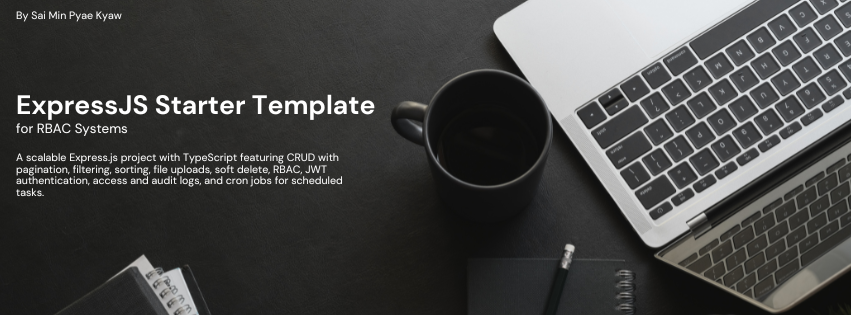

# ExpressJS Starter Template For RBAC Systems

A scalable Express.js project with TypeScript featuring CRUD with pagination, filtering, sorting, file uploads, soft delete, RBAC, JWT authentication, access and audit logs, and cron jobs for scheduled tasks.



## Features

- 🛡️ **Role-Based Access Control (RBAC)** – Fine-grained access control for different user roles and permissions.
- ✅ **CRUD Operations** – Create, Read, Update, Delete endpoints out of the box.
- 📄 **Pagination, Filtering, Sorting, Searching** – Easily manage large datasets with built-in pagination, query-based filtering, and sorting mechanisms.
- 📁 **File Upload** – Upload and manage files using multer.
- 🗑️ **Soft Delete** – Soft-delete support using timestamps instead of permanently removing data.
- 🧹 **Multi Delete & Multi Create** – Perform bulk operations with ease.
- 🔐 **Authentication & Login** – Token-based login system using JWT.
- 🕵️ **Access Logs** – Track all incoming requests for monitoring and debugging.
- 📜 **Audit Logs** – Record data changes with before/after snapshots for critical actions.
- ⏰ **Cron Jobs** – Scheduled background tasks using node-cron.

## 🧱 Tech Stack

- **Express.js** – Web framework
- **TypeScript** – Static type-checking
- **Mysql** – Database
- **Knex** – Query Builder
- **JWT** – Authentication
- **Multer** – File uploads
- **Node-Cron** – Scheduled jobs
- **Morgan** – Logging
- **Docker** - Containerization
- **ESLint, Prettier** - Controlling code quality
- **Husky** - Git hook

## 📦 Use Case Ideas

- Admin dashboards
- Internal tools
- APIs for web/mobile apps
- SaaS backends

## 🚀 Quick Start Guide

### ⚙️ Clone the repository

```bash
git clone https://github.com/MinPyaeKyaw/rbac-expressjs-starter.git
```

### ⚙️ Prerequisites

- **Node.js** (v16.x or higher) - [Download Node.js](https://nodejs.org/) 🌐
- **MySQL** - [Download MySQL](https://dev.mysql.com/downloads/) 💾

### 🛠️ Setting Up the Database

1. 📁 Navigate to the `src/docs` folder – you'll find a SQL file named `rbac_express.sql`.
2. 🗄️ Create a MySQL database named `rbac_express`.
3. 🧩 Run the SQL file in your database to create the required tables and seed data.

### 🛠️ Setting Up env

1. 📄 You'll find a .env.example file in the project root.
2. 📋 Copy the file and rename it to .env.

```bash
cp .env.example .env
```

3. 📝 Open the .env file and replace the placeholder values with your actual credentials.

### 🚀 Initiating the Project

1. ⚙️ Run these commands

```bash
cd rbac-expressjs-starter
npm install
npm run dev
```

2. ⚙️ Log in with this credential

   - username - sai min
   - password - saimin

3. 📄 Postman collection can be found in `src/docs` folder
4. 📝 Read detailed technical documentation [here](src/docs/tech_docs.md)

## 👨‍💻 Author

**Sai Min Pyae Kyaw**

💼 Passionate Full Stack Developer | Node.js | TypeScript | React | MySQL  
📍 Based in Myanmar

### 🌐 Connect with me

- 💼 [LinkedIn](https://www.linkedin.com/in/sai-min-pyae-kyaw-369005200/)
- 💻 [GitHub](https://github.com/MinPyaeKyaw)
- 🌍 [Facebook](https://www.facebook.com/minpyae.kyaw.73)

---

Made with ❤️ by Sai Min Pyae Kyaw
