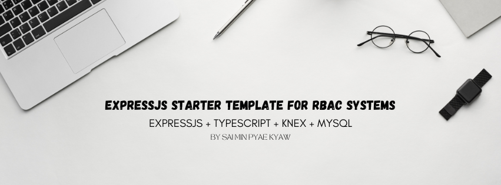

# ExpressJS Starter Template For RBAC Systems

A scalable Express.js project with TypeScript featuring CRUD with pagination, filtering, sorting, file uploads, soft delete, RBAC, JWT authentication, access and audit logs, and cron jobs for scheduled tasks.



## Features

- 🛡️ **Role-Based Access Control (RBAC)** – Fine-grained access control for different user roles and permissions.
- ✅ **CRUD Operations** – Create, Read, Update, Delete endpoints out of the box.
- 📄 **Pagination, Filtering, Sorting, Searching** – Easily manage large datasets with built-in pagination, query-based filtering, and sorting mechanisms.
- 📁 **File Upload** – Upload and manage files using multer.
- 🗑️ **Soft Delete** – Soft-delete support using timestamps instead of permanently removing data.
- 🧹 **Multi Delete & Multi Create** – Perform bulk operations with ease.
- 🔐 **Authentication & Login** – Token-based login system using JWT.
- 🕵️ **Access Logs** – Track all incoming requests for monitoring and debugging.
- 📜 **Audit Logs** – Record data changes with before/after snapshots for critical actions.
- ⏰ **Cron Jobs** – Scheduled background tasks using node-cron.

## 🧱 Tech Stack

- **Express.js** – Web framework
- **TypeScript** – Static type-checking
- **Mysql** – Database
- **Knex** – Query Builder
- **JWT** – Authentication
- **Multer** – File uploads
- **Node-Cron** – Scheduled jobs
- **Morgan** – Logging
- **Docker** - Containerization

## 📦 Use Case Ideas

- Admin dashboards
- Internal tools
- APIs for web/mobile apps
- SaaS backends

## 🚀 Quick Start Guide

### ⚙️ Clone the repository

```bash
git clone https://github.com/MinPyaeKyaw/rbac-expressjs-starter.git
```

### ⚙️ Prerequisites

- **Node.js** (v14.x or higher) - [Download Node.js](https://nodejs.org/) 🌐
- **MySQL** - [Download MySQL](https://dev.mysql.com/downloads/) 💾

### 🛠️ Initialize Project 🛠️

Start by initializing a new Node.js project.

```bash
cd rbac-expressjs-starter
npm i
npm run dev
```
