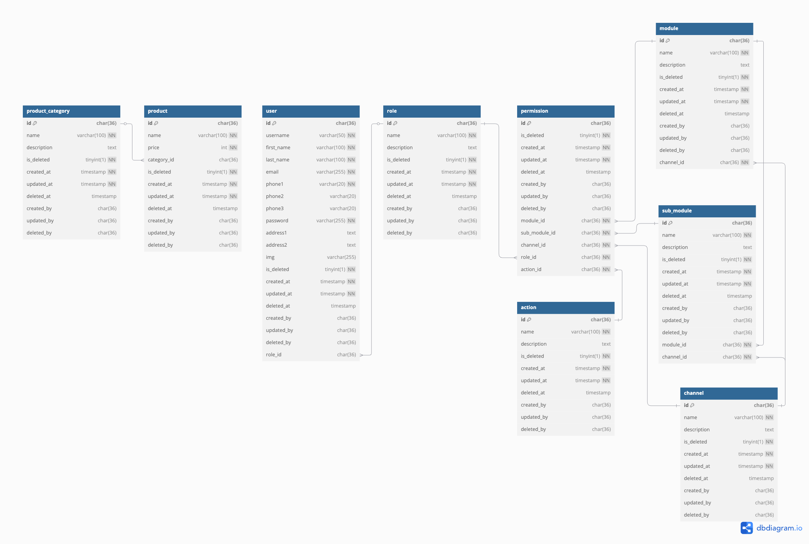

# Technical Documentation

Welcome to the **RBAC Express.js Starter Template** – a robust and scalable foundation for building secure RESTful APIs with **Role-Based Access Control (RBAC)**.

This template is crafted with best practices in mind, using **Node.js**, **Express.js**, **TypeScript**, **MySQL**, and **Knex**, and is ideal for building admin panels, internal tools, or any application requiring fine-grained permission control.

This documentation includes the following key areas:

- [API Documentation](#api-documentation)
- [ERD](#erd)
- [Architecture](#architecture)
- [Folder Structure](#folder-structure)
- [RBAC Implementation](#rbac-implementation)
- [Logging](#logging)
- [Integrating With External Service APIs](#integrating-with-external-service-apis)

---

## API Documentation

Postman collection is provided in `src/docs/api-docs`.

## ERD

🔗 [View on dbdiagram.io](https://dbdiagram.io/d/680675261ca52373f5c46e4d)

🗃️ Get a SQL file named `rbac_express.sql` in `src/docs` folder.



## Architecture

This project follows a **Feature-Based Architecture**, organizing code by business features rather than technical concerns (e.g., routes, controllers, models, etc.). You can find the folder structure in the [Folder Structure](#folder-structure) section.

### Why Feature-Based?

#### 📈 **High Scalability**

- Easy to scale and manage large codebases.
- Teams can work on separate features independently without conflicts.

#### 🛠️ **Better Maintainability**

- Easier to locate, update, and test business logic per domain.
- Simplifies bug tracking and debugging.

#### 🧱 **Separation of Concerns**

- Reduces coupling between unrelated parts of the codebase.

#### 🚀 **Improved Developer Productivity**

- Developers can focus on isolated features.
- Easier onboarding for new developers.

#### 🧩 **Modularity & Reusability**

- Promotes reusable and encapsulated modules.
- Easier to extract features into packages or microservices.

## Folder Structure

```
📁 rbac-expressjs-starter
├── 📁 src
│   ├── 📁 config
│   ├── 📁 cron-jobs
│   ├── 📁 docs
│   ├── 📁 external-services
│   ├── 📁 middlewares
│   │   ├── 📝 audit-log.ts
│   │   ├── 📝 error-handler.ts
│   │   ├── 📝 jwt.ts
│   │   ├── 📝 multer-upload.ts
│   │   ├── 📝 rbac.ts
│   │   ├── 📝 validation.ts
│   ├── 📁 features
│   │   ├── 📁 product
│   │   │   ├── 📝 route.ts
│   │   │   ├── 📝 controller.ts
│   │   │   ├── 📝 service.ts
│   │   │   ├── 📝 validator.ts
│   │   ├── 📁 ...
│   ├── 📁 storage
│   │   ├── 📁 logs
│   │   │   ├── 📝 audit.log
│   │   ├── 📁 uploads
│   ├── 📁 types
│   ├── 📁 utils
│   │   ├── 📝 common.ts
│   │   ├── 📝 http.ts
│   │   ├── 📝 log.ts
│   │   ├── 📝 node-mailer.ts
│   ├── 📝 app.ts
│   ├── 📝 api-client.ts
│   ├── 📝 routes.ts
│   └── 📝 server.ts
├── 📝 .dockerignore
├── 📝 .env
├── 📝 .gitignore
├── 📝 .prettierrc.json
├── 📝 Dockerfile
├── 📝 eslint.config.cjs
├── 📝 nodemon.json
├── 📝 package.json
├── 📝 tsconfig.json
└── 📝 README.md

```

## RBAC Implementation

This project implements **Role-Based Access Control (RBAC)** to ensure users only access what they are authorized for.

RBAC is structured around **Roles**, **Modules**, **Sub-Modules**, **Actions**, and **Channels**, enabling fine-grained control across features.

🟢 On login, the user’s configured permissions are included in the response.

### 🔍 RBAC Middleware

- Located in: `src/middlewares/rbac.ts`
- Apply it to each protected route.

### ⚙️ RBAC Configs

- Found in: `src/configs/rbac.ts`

### ✏️ Updating User Permissions

To update user permissions, call the `/api/permissions` endpoint using the **PATCH** method with a predefined payload structure.

> ⚠️ CRUD operations can be performed on roles, modules, sub-modules, channels, and actions – but remember to update the configurations accordingly afterward.

## Logging

This project uses **two types of logging**:

### 1. 🛣️ Access Logging (via Morgan)

- **Purpose:** Automatically records all incoming HTTP requests.
- **Setup:** Standard Morgan.
- **Output:** Console logs.

### 2. 🧾 Audit Logging (Custom)

- **Purpose:** Tracks sensitive or critical actions like:
  - API calls
  - User logins
  - Data changes

#### 📁 File Location

- Stored in: `src/storage/logs/audit.log`

#### 🧱 Format Definition

- Defined in: `config/log-format.ts`

#### ⚙️ How It Works

- Custom middleware captures audit logs.
- Use `logAudit` (from `utils/log.ts`) to manually log events.

## Integrating With External Service APIs

- Uses a custom **Axios instance**: `apiClient` (in `src/api-client.ts`)
- Already integrated with **audit logging**.
- Ensures all external API interactions are traceable.

---

## 👨‍💻 Author

**Sai Min Pyae Kyaw**

💼 Passionate Full Stack Developer | Node.js | TypeScript | React | MySQL  
📍 Based in Myanmar

### 🌐 Connect with me

- 💼 [LinkedIn](https://www.linkedin.com/in/sai-min-pyae-kyaw-369005200/)
- 💻 [GitHub](https://github.com/MinPyaeKyaw)
- 🌍 [Facebook](https://www.facebook.com/minpyae.kyaw.73)

Made with ❤️ by Sai Min Pyae Kyaw
